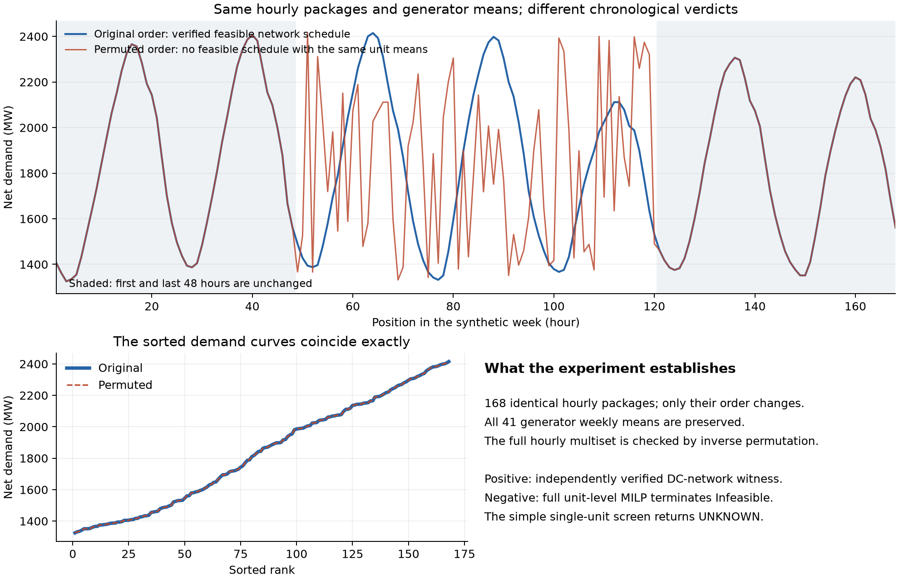

# نتيجة المرحلة التجريبية: ماذا نخسر عندما نحذف ترتيب الزمن؟

نفّذنا التجربة على نموذج RTS، انطلاقًا من جدول يوليو المعدّل الذي سبق التحقق
من إمكان تشغيله. النتيجة الأساسية: **يمكن للبيانات الساعية نفسها، بالمتوسطات
نفسها، أن تعطي حكمين تشغيليين مختلفين عندما يتغيّر ترتيب الساعات.**

## التجربة الحاسمة

أبقينا أول 48 ساعة وآخر 48 ساعة كما هي، وغيّرنا ترتيب الساعات الـ72 الداخلية.
نقلنا حزمة كل ساعة كاملة: الطلب عند العقد، والإتاحات، وإنتاج الألواح المضمّن
في الطلب، وصف التشغيل المرتبط بها. لم نغيّر قيم هذه البيانات أو متوسطات
المولدات الـ41. تحقق البرنامج من استرجاع الحزم الأصلية حرفيًا عند عكس الترتيب.

- **الأسبوع الأصلي:** اجتاز فحص توازن القدرة، والشبكة، وحدود الخطوط والوحدات،
  والسرعات، والمدد الدنيا للتشغيل والإيقاف.
- **أول أربعة ترتيبات محددة سلفًا:** انتهى الحل الكامل إلى الاستحالة، حتى بعد
  إسقاط قيود الشبكة. هذا يستبعد وجود جدول بديل يحقق المتوسطات نفسها ضمن
  هذا النموذج؛ النتيجة أوسع من مجرد فشل إعادة تشغيل الجدول المنقول.
- **الفحص السريع الحالي:** لم يكتشف أيًا من الحالات الأربع، ولا أصدر شهادة
  رفض لأي من الترتيبات الستة عشر. احتفظنا بهذه النتيجة السلبية كما هي.
- **الترتيبات الاثنا عشر الأخرى:** لم تُحل بالنموذج الكامل ضمن البروتوكول؛
  حكمها يبقى غير محسوم.

إذا أعطينا أي طريقة معلومات ساكنة متطابقة لهذين الأسبوعين فقط، فسترى المدخل
نفسه. لذلك لا تستطيع إصدار حكم صحيح وحاسم للحالتين معًا؛ تحتاج معلومة عن
ترتيب الزمن أو أن تمتنع عن الحكم. هذا استنتاج من المثال، وليس ادعاء بأن
فكرة أهمية الزمن جديدة في الأدبيات.

## هل السبب تثبيت اسم كل مولّد؟

اختبرنا تخفيفًا محددًا: جمع الطاقة الأسبوعية للوحدات المتطابقة في صفاتها
الممثلة بالنموذج والموجودة عند العقدة نفسها، مع إبقاء كل وحدة وقيودها الزمنية
منفصلة. انخفضت قيود المتوسط من 41 إلى 26 مجموعة. بقيت **الأسابيع الثمانية
الأصلية كلها مرفوضة**. إذن هذا التخفيف لا يزيل الرفض في هذه العينة.

التطابق هنا في بيانات النموذج، وليس إثباتًا للتطابق الميداني أو للانبعاثات
الفعلية. نتيجة هذا الاختبار لا تمتد تلقائيًا إلى تجميع وحدات مختلفة أو من
عقد مختلفة.

أجرينا بعد ذلك الاختبار نفسه على الترتيبات الأربعة الجديدة، باستخدام متوسطات
الأسبوع المعدّل الممكن. بقيت الأربعة مستحيلة، واجتاز الأصل الممكن فحص
المتوسطات المجمّعة. إذن المثال الجديد أيضًا يصمد أمام هذا التخفيف.

## تقوية دليل الاستحالة

أعدنا بناء استرخاء خطي للمسألة بصورة مستقلة. بقيت الترتيبات الأربعة مستحيلة
حتى عندما سمحنا لمتغيرات التشغيل أن تأخذ قيمًا كسرية. استخرجنا لكل حالة
شهادة تناقض يمكن التحقق منها بالحساب الكسري الدقيق دون تشغيل المحلّل.

هذه الدقة تخص معاملات النموذج المحفوظة على الحاسوب، وليست ادعاء بدقة
القياسات الميدانية. بقي التناقض قائمًا بعد توسيع حدود الصفوف والمتغيرات
بمقدار `1e-5` لكل حد بوحدته. الشهادات الحالية تستخدم بين 656 و1017 قيدًا
وتمتد إلى 163–168 ساعة، بالإضافة إلى حدود المتغيرات وقيود الطاقة الكلية؛
لذلك ليست إثباتًا لأقل معلومات زمنية لازمة.

## ما الذي أنجزناه في تفسير الرفض؟

على الحالات القديمة التي سبق فحصها، استخرج البرنامج تفسيرات تضم **من حالة
زمنية واحدة إلى خمس حالات** لمولد محدد، إلى جانب طاقته وشروط تشغيله. تحقّق
فاحص مستقل من تناقض كل تفسير، ومن أن إزالة أي حالة باقية تزيل ذلك التناقض.

مثال يناير: ساعة محددة تفرض تشغيل الوحدة `123_STEAM_3`. موضع هذه الساعة
وشروط الوحدة يستلزمان ما لا يقل عن 24 ساعة تشغيل، بينما الطاقة الأسبوعية
المستهدفة تسمح بحد أقصى 23 ساعة. يظهر التعارض بوضوح من هذه المقارنة.

هذا **اختصار للتفسير**؛ استخراج تلك الحالة الزمنية قد يعتمد على بيانات
الأسبوع كله. لم نثبت بعد أقل حجم بيانات أو أقل ذاكرة لازمة للحكم، ولم
ننتج بهذا الفحص تفسيرًا للحالات الأربع الجديدة.

## القرار العلمي

لدينا الآن مثال مضبوط يدعم سؤالًا أقوى للبحث: **ما المعلومات الزمنية
الإضافية التي يجب حفظها حتى يصبح الحكم التشغيلي موثوقًا؟** ولدينا أيضًا
اختبار يكشف أن الشهادة البسيطة الحالية لا تكفي للإجابة.

هذه مرحلة بحثية تجريبية قابلة لإعادة الإنتاج، وليست تجربة ميدانية أو إثباتًا
لأداء عام. النسخة الحالية من المخطوطة والأرشيف المنشور محفوظان؛ النتائج هنا
منفصلة، ولا تجعل ادعاء «أقل معلومات زمنية» جاهزًا للإرسال بعد.

الملفات: [البروتوكول](docs/TEMPORAL_INFORMATION_PROTOCOL.md)،
[نتائج الترتيبات](results/temporal_information/twins/summary.csv)،
[اختبار تجميع الوحدات](results/temporal_information/equivalence/summary.csv)،
[تجميع الوحدات في الترتيبات الجديدة](results/temporal_information/equivalence_twins/summary.csv)،
[الشهادات الحسابية](results/temporal_information/lp_certificate/summary.json)،
[التفسيرات المختصرة](results/temporal_information/existing_cores/summary.csv)،
[المراجعة الرياضية المستقلة](docs/TEMPORAL_INFORMATION_MATH_AUDIT.md).
